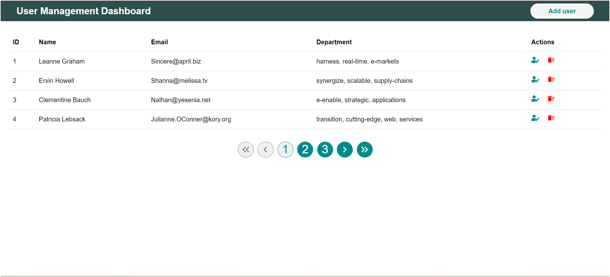
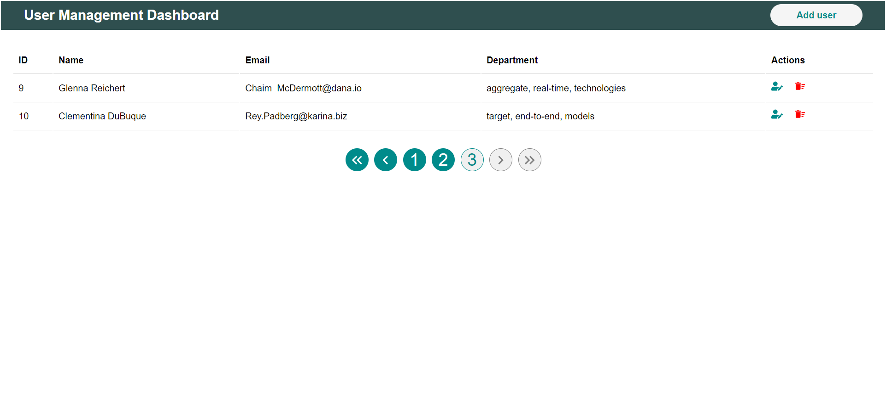
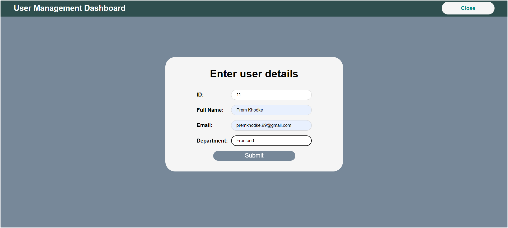
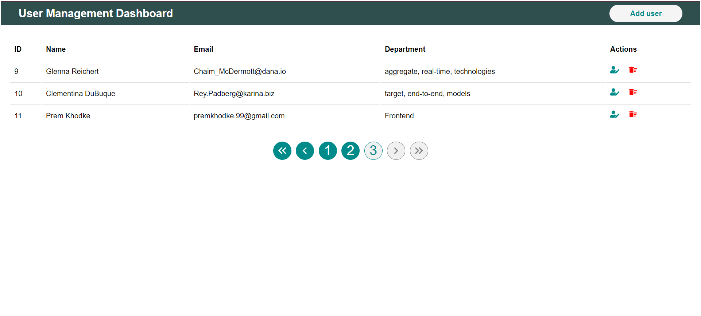
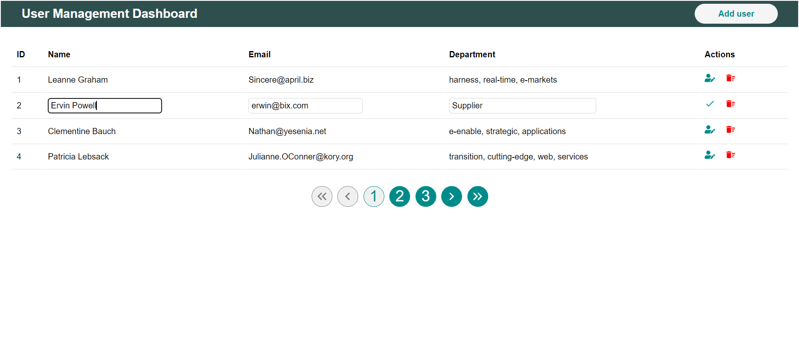
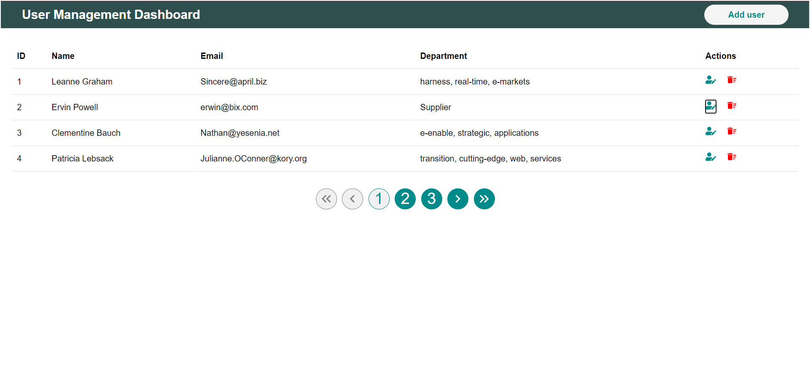
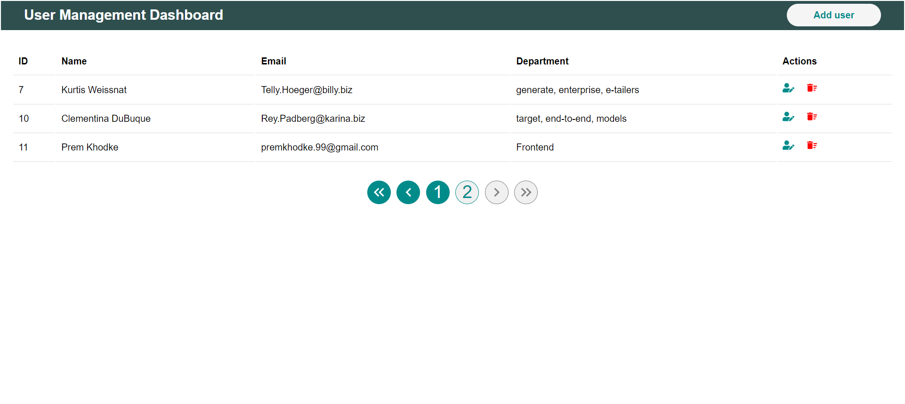

# User Management Dashboard

Develop a simple web application where users can view, add, edit, and delete user details from a mock backend API.

## Appendix

This Project is created using JavaScript library 'React.Js' and Raw CSS. To fetch data from API used [axios](https://axios-http.com/docs/intro) and for icons used [react-icons](https://react-icons.github.io/react-icons/).
Data is fetch from [JSONPlaceholder](https://jsonplaceholder.typicode.com/).

## Screenshots

### Homepage

### Pagination

### Add user

### User Added

### Edit User

### User edited

### Delete

## Features

- Pagination
- Add New User
- Edit Existing User
- Delete User

## Challenges Faced during development

- Sharing data as props from one component to multiple other components.
- Managing and keeping note of every prop shared.
- While editing every data's edit botton was change so to overcome that problem I created new component.

## Improvements I would make if given more time.

- To manage props I would have used Redux Toolkit, which would have overcome the prop-drilling problem.
- Would have made UI more attractive by using CSS frameworks like Tailwind CSS or Material UI.

## Link
[Click here](https://user-management-dashboard-ochre.vercel.app/)

# React + Vite

This template provides a minimal setup to get React working in Vite with HMR and some ESLint rules.

Currently, two official plugins are available:

- [@vitejs/plugin-react](https://github.com/vitejs/vite-plugin-react/blob/main/packages/plugin-react/README.md) uses [Babel](https://babeljs.io/) for Fast Refresh
- [@vitejs/plugin-react-swc](https://github.com/vitejs/vite-plugin-react-swc) uses [SWC](https://swc.rs/) for Fast Refresh
